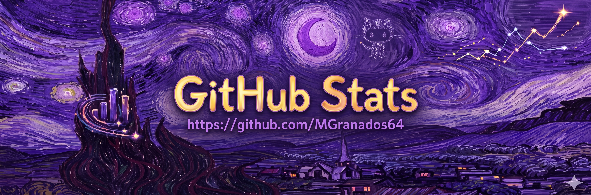
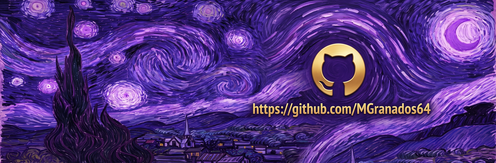

  

<h1 align="center">Hi there, I'm Miguel Granados 👋</h1>
<h3 align="center">M.Sc. in Artificial Intelligence | AI & Prompt Engineer</h3>

Welcome to my GitHub! I hold a Master's degree in Artificial Intelligence and currently work as a Prompt Engineer specializing in LLMs applied to finance and accounting[cite: 1]. Drawing from a 6-year background in automotive service and commissioning engineering across the UK and Germany[cite: 1], I bring a highly analytical, industrial-grade problem-solving approach to AI architecture.

My core expertise spans Agentic AI, Prompt Engineering, and developing scalable evaluation frameworks using Python, PyTorch, and LangChain[cite: 1]. Recently, I achieved a 91% reduction in financial reporting time by architecting multi-step agentic workflows for automated data extraction and reconciliations[cite: 1]. Whether designing LegalTech RAG platforms, building autonomous agents evaluated with RAGAS and LLM-as-Judge, or deploying full-stack computer vision models[cite: 1], I thrive on bridging AI theory with robust, production-ready engineering.

---

## 👨‍💻 About Me

- 💼 I’m currently working as an **AI & Prompt Engineer**, optimizing financial processes and deploying production-level LLM architectures[cite: 1].
- 🎓 I hold a **Master of Science in Artificial Intelligence**[cite: 1].
- 🔭 My master's thesis focused on a **Multi-agent system for early cancer detection using machine vision**[cite: 1].
- 🌱 I’m currently building robust **evaluation frameworks (Agentic Evals, LLM-as-Judge)** for RAG and autonomous agents[cite: 1].
- 👯 I’m looking to collaborate on **Agentic workflows, GenAI evaluation, and Full-Stack AI integration projects**.
- 💬 Ask me about **Prompt Engineering, RAGAS, LangChain, Vue 3, and automated OCR deployment**[cite: 1].
- 📫 How to reach me: **mgranadosc91@gmail.com**[cite: 1].
- ⚡ Fun fact: I previously worked as a Commissioning Engineer for powertrains in the UK and Germany[cite: 1], and I speak Spanish, English, and German[cite: 1]! 

---

## 🛠️ Tech Stack & Tools

  
  
  
  
  
  
  
  
  
  
  
  
  
  
  

---

## 🚀 Featured Experience & Projects

| Project / Focus | Description | Tech Stack |
| :--- | :--- | :--- |
| **Financial Reporting Automation** | Orchestrated multi-step agentic workflows reducing financial report elaboration time by 91%[cite: 1]. | `Prompt Engineering`, `LLMs`, `Agents` |
| **LegalTech RAG Platform** | Developed a semantic search CRM using pgvector and local models, achieving 100% hit@8 validated with RAGAS[cite: 1]. | `RAG`, `Vue 3`, `Supabase` |
| **Fiscal OCR Automation** | Automated CFDI receipt extraction deployed on HF Spaces with auditable logging and pytest validation[cite: 1]. | `Tesseract`, `PaddleOCR`, `DeepSeek` |
| **Agentic Evaluation Frameworks** | Designed evals for prompts and benchmarking of local/cloud models using LLM-as-judge mechanics[cite: 1]. | `RAGAS`, `LLMOps`, `Python` |
| **Cancer Detection System** | Master's thesis: Multi-agent system for early cancer detection utilizing advanced artificial vision techniques[cite: 1]. | `Computer Vision`, `PyTorch` |

---

## 📊 GitHub Stats

  

  

---

## 🤝 Connect with me

  
  
  
  
  

